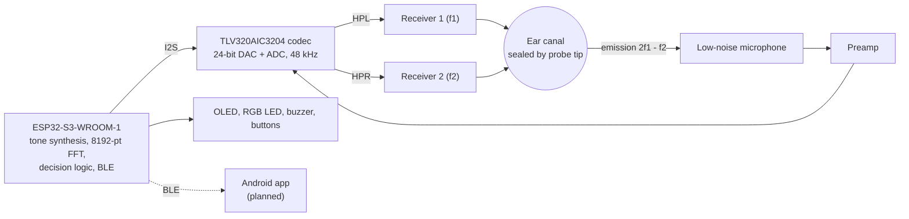
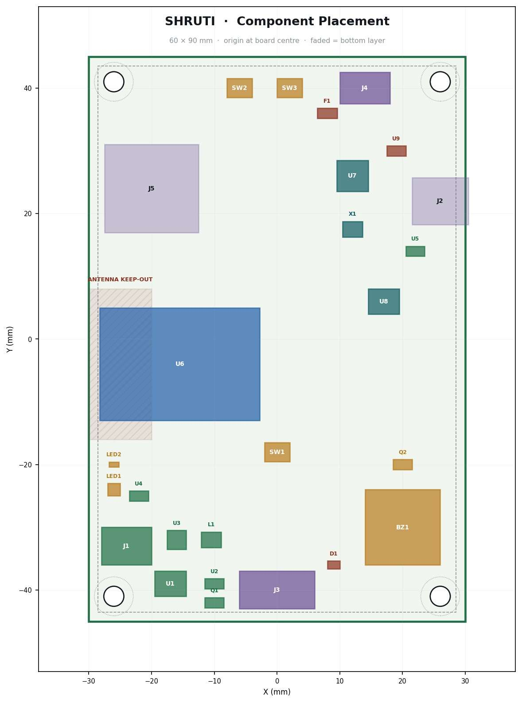

# SHRUTI

**An ultra-low-cost handheld newborn hearing screener using Distortion-Product Otoacoustic Emissions (DPOAE).**

> **Project status: early-stage research prototype.**
> SHRUTI is **not** a clinically validated medical device and has not been tested on infants. Its output is a **screening result, not a diagnosis**. See the [Disclaimer](#disclaimer).

---

## Contents

1. [Project description](#1-project-description)
2. [Problem statement](#2-problem-statement)
3. [Proposed solution](#3-proposed-solution)
4. [How DPOAE-based screening works](#4-how-dpoae-based-screening-works)
5. [Key features](#5-key-features)
6. [System architecture](#6-system-architecture)
7. [Hardware components](#7-hardware-components)
8. [Firmware and DSP approach](#8-firmware-and-dsp-approach)
9. [Software and app architecture](#9-software-and-app-architecture)
10. [Prototype status](#10-prototype-status)
11. [Testing and validation status](#11-testing-and-validation-status)
12. [Expected impact](#12-expected-impact)
13. [Repository structure](#13-repository-structure)
14. [Getting started (software simulator)](#14-getting-started-software-simulator)
15. [Team](#15-team)
16. [Contributing](#16-contributing)
17. [References](#17-references)
18. [License](#18-license)
19. [Disclaimer](#disclaimer)

---

## 1. Project description

SHRUTI is a hardware + software project for **low-cost newborn hearing screening**. A handheld probe plays two pure tones into the infant's ear canal and listens for the ear's own response — a third tone, the distortion-product otoacoustic emission (DPOAE) at **2f₁ − f₂**. A microcontroller-based device analyses the response on-device and reports **PASS / REFER / RETEST**, which is then intended to sync to an offline-first Android app used by frontline health workers (ASHA / ANM).

The project targets a specific gap: in India, universal newborn hearing screening is limited largely by the cost of imported screening equipment and the scarcity of audiologists. SHRUTI explores whether a purpose-built device with a bill of materials of roughly ₹5,000 can remove the cost barrier.

## 2. Problem statement

The figures below are taken from the project's internal-round presentation, which cites the sources listed in [References](#17-references).

- Roughly **5–6 per 1,000** Indian newborns are born hard of hearing, and most are not identified until age 2 or later [1].
- The presentation estimates **1.15–1.38 lakh** infants are born hard of hearing in India each year.
- Intervention is most effective when it starts before **six months** of age [3].
- Cost of machines is cited as a barrier to screening under the National Programme for Prevention and Control of Deafness (NPPCD) [1]. The presentation quotes **₹1.85–2.9 lakh** for an imported OAE screener.
- There is roughly **1 audiologist per 5,00,000 people**, and only **38% of medical colleges** run a screening programme [2].
- The presentation describes current practice as "refer and hope": no tracking of which referred infants actually return for follow-up. (Reference [4] discusses follow-up attendance as one of five programme quality metrics.)

> **To be added:** direct sources for the imported-device price range and the annual affected-infant estimate (they are stated in the presentation without a dedicated citation).

## 3. Proposed solution

SHRUTI is a battery-powered, pocket-sized probe-and-device system paired with a follow-up workflow.

- A handheld probe delivers two pure tones (f₂/f₁ = 1.22, L₁/L₂ = 65/55 dB SPL) at f₂ = 2, 3, 4 and 5 kHz.
- A low-noise microphone in the same probe listens for the cochlear emission at 2f₁ − f₂ (about 0 dB SPL).
- A 24-bit codec and an ESP32-S3 perform in-situ calibration, coherent averaging and artifact rejection on-device.
- The verdict appears on an OLED in under 30 seconds: **PASS / REFER / RETEST** — never a diagnosis.
- Results are intended to sync over BLE to an offline-first Android app.
- Each REFER is intended to be attached to the infant's next immunisation visit (6/10/14 weeks) so that re-screening happens at a visit the family already makes.

**Design differentiators (from the presentation):**

- **Two separate balanced-armature receivers**, one per tone, so the device cannot itself manufacture the intermodulation emission it is trying to detect.
- **Bin-exact stimulus:** f₁, f₂ and 2f₁ − f₂ are chosen to fall on exact FFT bin centres, avoiding spectral leakage from the 65 dB primaries.
- **Per-ear in-situ calibration** to compensate for canal volume and probe seal before every test.
- **Abstains rather than guesses:** the device is designed to refuse a PASS when the seal is poor or ambient noise is excessive.

## 4. How DPOAE-based screening works

A healthy cochlea does not only receive sound — its outer hair cells actively amplify it, and in doing so they generate sound. When two pure tones **f₁** and **f₂** are presented together, a working cochlea produces an additional tone at **2f₁ − f₂**, which a sensitive microphone in the ear canal can detect. If the emission is absent, the outer-hair-cell function that generates it is not confirmed.

Worked example from the presentation:

| Quantity | Value |
| --- | --- |
| f₁ | 3281 Hz at 65 dB SPL |
| f₂ | 4002 Hz at 55 dB SPL |
| Expected emission 2f₁ − f₂ | 2561 Hz, about 0 dB SPL |

**Decision outputs**

| Output | Meaning |
| --- | --- |
| **PASS** | Emission detected at the required criterion. |
| **REFER** | Emission not detected; follow-up / re-screen / referral pathway. |
| **RETEST** | Technically insufficient test (for example poor seal or excess noise); repeat the acquisition. This is not a clinical result. |

The feasibility analysis uses a **6 dB SNR criterion**. In the concept video and the software simulator in this repository, PASS is defined as SNR ≥ 6 dB at **≥ 3 of 4** test frequencies. *The final on-device decision rule is to be confirmed through bench and human testing.*

**A PASS or REFER is a screening outcome only.** Definitive assessment of hearing requires diagnostic evaluation (for example ABR) by qualified audiologists.

## 5. Key features

These are the **design goals** of the system; see [Prototype status](#10-prototype-status) for what is currently documented in this repository.

- Handheld, battery-powered, pocket-sized probe suitable for outreach camps and home births
- Two-tone DPOAE stimulus using separate receivers for f₁ and f₂
- On-device DSP: 48 kHz sampling, 8192-point FFT, phase-locked coherent averaging, adaptive frame rejection
- Per-ear in-situ calibration before every test
- Explicit PASS / REFER / RETEST output, with abstention on bad seal or excess noise
- OLED result display; BLE link to an offline-first Android app
- Disposable silicone ear tips as the only consumable
- Follow-up workflow that ties every REFER to a tracked outcome

## 6. System architecture

Signal flow (based on the main-board block diagram in the presentation): the MCU synthesises f₁ and f₂, the codec DAC drives two **separate** outputs feeding two receivers, and the emission returns through the microphone → preamp → codec ADC → MCU FFT → verdict.



**Main board (60 × 90 mm, 4-layer)** — per the presentation:

- Power: 18650 cell, TP4056 charger, cell protection, TPS63020; USB-C receptacle (native USB, no UART bridge needed).
- Regulation: a digital 3V3 rail and a **separate ultra-low-noise 3V3A analog rail** (used for the analog front end; the two receivers sit on it as well).
- One clock domain: 12.288 MHz TCXO feeding the codec for an exact 48 kHz sample rate.
- UI and storage: I²C OLED, test/boot/reset buttons, RGB LED, buzzer, microSD (SPI).
- Probe connector: 6-pin JST-SH carrying RCV1 (f₁), RCV2 (f₂) and the microphone line.
- ESP32-S3 antenna keep-out respected in placement.

Component placement (from the presentation; a planned layout, not a photograph of a fabricated board):



## 7. Hardware components

As listed in the presentation. Part selections are proposed and may change; **schematics, layout files and a verified BOM are to be added** (see [`Prototype/Hardware`](Prototype/Hardware/)).

| Function | Component |
| --- | --- |
| Stimulus transducers | 2 × Knowles ED-29689 balanced-armature receivers (one per tone) |
| Microphone | Low-noise, ≤ 27 dB(A) EIN; candidates listed: FG-23629 / ICS-40730 |
| Audio codec | TI TLV320AIC3204, 24-bit, DAC + ADC on one MCLK domain |
| Microcontroller | ESP32-S3-WROOM-1 N16R8 (16 MB flash, 8 MB octal PSRAM) |
| Preamplifier | OPA1662 (per the hardware list; see note below) |
| PCB | 60 × 90 mm, 4-layer |
| Probe | 3D-printed 3-lumen probe with disposable silicone tips |
| Display | OLED (I²C) |
| Communication | BLE (ESP32-S3) |

> **Note — to reconcile:** the presentation's hardware list names the preamplifier as OPA1662, while its block diagram labels the preamp (U8) as OPA2365. The final part is **to be confirmed**.

**Cost estimate (from the presentation — a costed estimate, not a measured production cost):**

| Item | ₹ |
| --- | --- |
| 2 × balanced-armature receivers | 1,600 |
| Low-noise microphone | 700 |
| 24-bit codec (TLV320AIC3204) | 450 |
| ESP32-S3-WROOM-1 N16R8 | 350 |
| Preamp, drivers, power, 4-layer PCB | 1,030 |
| Probe, enclosure, OLED, tips, cable | 870 |
| **Prototype total** | **≈ 5,000** |

The presentation projects about ₹2,700 per unit at 10,000 units, against ₹1.85–2.9 lakh for imported OAE screeners.

## 8. Firmware and DSP approach

**Planned firmware:** C/C++ on ESP-IDF, using the ESP-DSP library for FFT.

| Parameter | Value |
| --- | --- |
| Sampling rate | 48 kHz |
| FFT length | 8192 points (≈ 5.86 Hz per bin) |
| Averaging | Phase-locked A/B coherent averaging |
| Artifact handling | Adaptive frame rejection |
| Calibration | Per-ear, in-situ, before every test |
| Stimulus | f₁, f₂ and 2f₁ − f₂ placed on exact FFT bin centres |

**Design-stage noise budget (calculation from the presentation, not a measurement):**

- Microphone self-noise of 27 dB(A) corresponds to about −13.0 dB SPL/√Hz, or about −5.3 dB in a 5.86 Hz FFT bin.
- After 4 s of coherent averaging (23 frames, +13.6 dB) the electronic noise floor is about **−18.9 dB SPL**.
- With a target emission of about 0 dB SPL and a 6 dB SNR criterion, this leaves about **13 dB of margin**.
- Ambient noise and the system's own distortion, not electronic noise, are expected to be the limiting factors and are designed against.

> **Firmware source code: To be added.** No ESP32-S3 firmware is included in this repository yet.

## 9. Software and app architecture

Two software components are relevant, at different stages:

**a) Android app (planned)** — an offline-first app for ASHA / ANM users that receives results from the device over BLE, keeps records without connectivity, and supports the follow-up workflow: every REFER is auto-attached to the next 6/10/14-week immunisation visit; re-screen at that visit; ABR referral if needed; missed visits trigger SMS → ASHA home visit → block-level worklist.
**Android source code: To be added.**

**b) Reference DSP, simulator and console (available)** — [`Prototype/Software`](Prototype/Software/) implements the screening pipeline in Python and runs it against a **synthetic ear**, so the signal-processing design and the PASS / REFER / RETEST rules can be tested without hardware or infants. It is intended to become the reference the firmware is checked against.

| Component | What it does |
| --- | --- |
| `signal_processing.py` | 48 kHz / 8192-point FFT, bin-exact stimulus plan, phase-locked coherent averaging with A/B split, probe-fit check, in-situ calibration, frame rejection, per-frequency detection |
| `ear_simulator.py` | Synthetic ear, probe and noise: hair-cell function, seal, ambient noise, crying/movement, two-receiver vs shared-transducer distortion |
| `screening.py`, `clinical_engine.py` | Stage sequencing, per-ear and overall decisions, follow-up scheduling |
| `simulation_study.py` | Sealed-cavity trials, distortion self-test, sweeps over noise, interference and hair-cell function |
| `server.py`, `console.html` | Local FastAPI server and browser console (screening, what-if simulator, registry, follow-up, analytics, devices, validation, architecture) |
| `tests/` | pytest suite (about 40 tests) |

Every verdict, spectrum and statistic shown in the console is computed by the pipeline; nothing is hard-coded or randomly invented. The constants, and which of them come from the presentation and which are simulator assumptions, are listed in [`Simulation-Model.md`](Documentation/Technical-Documentation/Simulation-Model.md). The on-screen product name is set in `config.py`.

**Limitations of the current software:**

- It runs on **synthetic signals** and is not connected to the device.
- The ear model is not physiology; thresholds marked as assumptions are placeholders until bench data exist.
- The simulated cohort contains an artificially high share of impaired ears, so its rates are not prevalence.
- Data is held in memory only; the server is a local demo, not a deployable service.

A broader software design specification is in [`Documentation/Technical-Documentation/Software-Integration-Design.md`](Documentation/Technical-Documentation/Software-Integration-Design.md). It describes an intended ecosystem, **much of which is not implemented** (only the reference DSP, simulator and console above exist).

## 10. Prototype status

| Component | Status |
| --- | --- |
| Concept, physics and feasibility analysis | Documented in the [presentation](Presentation/SHRUTI-Internal-Round-Presentation.pdf) |
| Main-board block diagram and component placement (60 × 90 mm, 4-layer) | Documented (placement image in [`Images/PCB`](Images/PCB/)) |
| Schematics, PCB layout / Gerber files, verified BOM | **To be added** |
| Fabricated / assembled hardware and photographs | **To be added** |
| 3D-printed probe (CAD / STL / photographs) | **To be added** |
| ESP32-S3 firmware | **To be added** (the Python reference DSP is available) |
| Reference DSP, simulator and console (synthetic ear) with automated tests | Available in [`Prototype/Software`](Prototype/Software/) |
| Android app | **To be added** |
| Concept explainer video | Available in [`Demo`](Demo/) (animation with placeholder graphics; not footage of a working device) |
| Dashboard / app screenshots | **To be added** |

## 11. Testing and validation status

**No bench-test, adult-volunteer or neonatal results are included in this repository, and SHRUTI has not been clinically validated.**

The software has its own automated tests and a live *simulation study* (Validation tab). These verify that the code implements the design — for example that a sealed simulated cavity never yields a PASS — but they use a synthetic ear and are **not** evidence of device performance.

The presentation defines acceptance criteria in advance, in three tiers (see [`Documentation/Testing`](Documentation/Testing/)):

| Tier | Scope | Acceptance criteria (as planned) | Status |
| --- | --- | --- | --- |
| 1 | Bench, no ethics approval needed | System 2f₁ − f₂ ≤ −15 dB SPL, and ≤ 1 PASS in 120 repetitions into sealed 0.05 / 0.1 / 0.2 mL cavities | Results to be added |
| 2 | ≈ 30 normal-hearing adults | PASS/REFER agreement against a clinical ERO·SCAN / Titan, reported as Cohen's kappa plus Bland–Altman analysis on DP amplitude | Not started / to be added |
| 3 | Neonatal | Protocol written and IEC (ethics committee) submission prepared with a clinical partner, per the presentation; no newborn data claimed | Not claimed |

## 12. Expected impact

*The following are projections from the presentation, not measured outcomes.*

- **Earlier detection:** moving detection from about 24 months to under 1 month of age, inside the < 6-month intervention window.
- **Lower capital cost:** about 74× lower capital cost to equip a facility with a screener, and about ₹493 crore saved across 25,000 public facilities (≈ ₹6.75 crore instead of ≈ ₹500 crore), as computed in the presentation from the projected ₹2,700 unit cost at 10,000 units.
- **Access:** an objective test that an ASHA or ANM can run after about two hours of training, in a country with roughly one audiologist per 5,00,000 people; portable enough for outreach camps and home births.
- **Follow-up:** closing the loop — screen at birth → REFER → auto-attach to a 6/10/14-week immunisation visit → re-screen → ABR referral → missed-visit escalation.
- **Environmental:** repairable, battery-powered, domestically manufacturable; the only consumable is a low-cost ear tip.

## 13. Repository structure

```
SHRUTI/
├── README.md
├── LICENSE
├── .gitignore
├── Presentation/
│   └── SHRUTI-Internal-Round-Presentation.pdf
├── Prototype/
│   ├── Hardware/          # schematics, PCB, BOM, probe CAD — to be added
│   ├── Firmware/          # ESP32-S3 firmware and DSP — to be added
│   └── Software/          # reference DSP, simulator, console, tests (Android app: to be added)
├── Demo/
│   ├── README.md
│   └── SHRUTI-concept-explainer.mp4
├── Documentation/
│   ├── Technical-Documentation/
│   │   ├── Simulation-Model.md
│   │   └── Software-Integration-Design.md
│   └── Testing/
│       └── README.md      # test plan and (future) results
└── Images/
    └── PCB/
        └── pcb-component-placement.jpg
```

Further folders (`Documentation/Problem-Statement/`, `Documentation/References/`, `Images/Prototype/`, `Images/Screenshots/`) will be added when there is content for them.

## 14. Getting started (software simulator)

Requirements: Python 3.10 or newer (developed and tested on 3.12).

```powershell
cd Prototype\Software
python -m venv .venv
.\.venv\Scripts\Activate.ps1
pip install -r requirements.txt
python server.py
```

Then open `http://127.0.0.1:8000/` (API docs at `/docs`). On Linux/macOS, activate the environment with `source .venv/bin/activate`.

To run the tests:

```powershell
pip install -r requirements-dev.txt
pytest
```

## 15. Team

**Team QUARK 2.0**

- Abhinav Garg
- Neha Sharma
- Utkarsh Gupta
- Aditya Garg
- Ansh Goyal
- Shruti Shreshtha

## 16. Contributing

Issues and suggestions are welcome, especially on DSP methodology, acoustic design and validation planning. Please open an issue before starting large changes. Contributions must not include real patient or infant data, and must not make clinical-performance claims without supporting evidence.

## 17. References

Listed as in the project presentation.

1. *Infant Hearing Screening in India: Current Status and Way Forward* — https://pmc.ncbi.nlm.nih.gov/articles/PMC4689099/
2. *Perspectives of newborn hearing screening in resource-constrained settings* — https://pmc.ncbi.nlm.nih.gov/articles/PMC7691834/
3. *Making a Difference from Day One: Universal Neonatal Hearing Screening* — https://pmc.ncbi.nlm.nih.gov/articles/PMC11674813/
4. *Egyptian National Newborn Hearing Screening Programme — 4-year outcomes* — https://pmc.ncbi.nlm.nih.gov/articles/PMC12641659/
5. Gorga et al., *Identification of neonatal hearing impairment: DPOAEs*, Ear & Hearing, 2000 — https://pubmed.ncbi.nlm.nih.gov/11059701/
6. *Stakeholders' perspective for improved UNHS uptake in Odisha*, Journal of Tropical Pediatrics, 2021 — https://academic.oup.com/tropej/article/67/3/fmaa062/5905598

The presentation's slides were prepared for an internal selection round; the team name printed on them predates the current team name, QUARK 2.0.

## 18. License

Released under the **Apache License 2.0** — see [LICENSE](LICENSE). Hardware design files, when added, may be published under a separate hardware license (**to be decided**).

## Disclaimer

SHRUTI is a **research and educational prototype**. It is **not** a clinically validated medical device, has not been tested on infants, and no regulatory approval is claimed. Its PASS / REFER / RETEST output is a **screening result, not a diagnosis**; a definitive determination of hearing status requires diagnostic evaluation by qualified audiology professionals. Do not use this project to make clinical decisions. The simulator in this repository uses a synthetic ear model, and no hardware performance data is included. Cost, impact and performance figures are projections or design-stage calculations taken from the project presentation unless stated otherwise.
